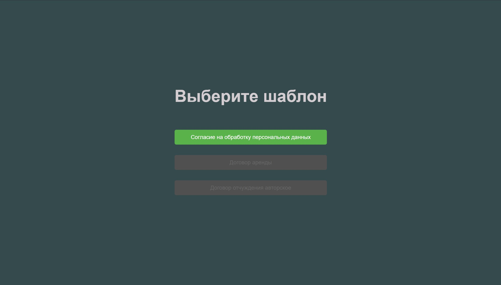

# DocBuilder / Создание договоров из шаблона

PET-проект для создания договоров на основе предустановленных шаблонов.

[Демо-страница](https://doc-builder-h7aevj84t-alexandrs-projects-58850a68.vercel.app/)

## Описание

Микропроект на Vue, созданный для упрощения и ускорения процесса заполнения договоров.
Пользователь выбирает шаблон, заполняет необходимые поля, и на выходе получает готовый документ.

### 🚀 Возможности:

- Выбор готового шаблона договора.
- Заполнение ячеек с данными прямо в интерфейсе.
- Одно нажатие — и готовый документ скачивается.
- Возможность добавления нескольких шаблонов.

---

### Технологии и стек
- 🧠**Vue.js**: Фронт.
- 🖼**Docker**: Кнтейнеризация проекта.
- **Используемые тохнологии**: docxtemplater, file-saver, pizzip.

